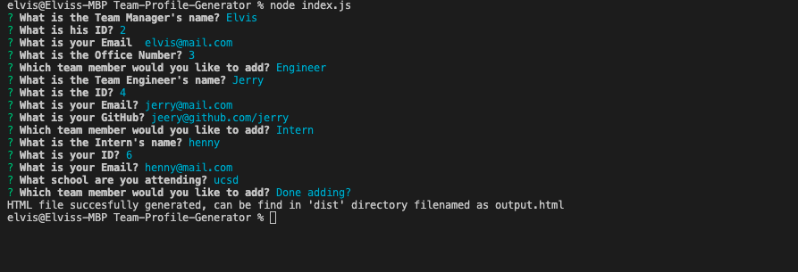
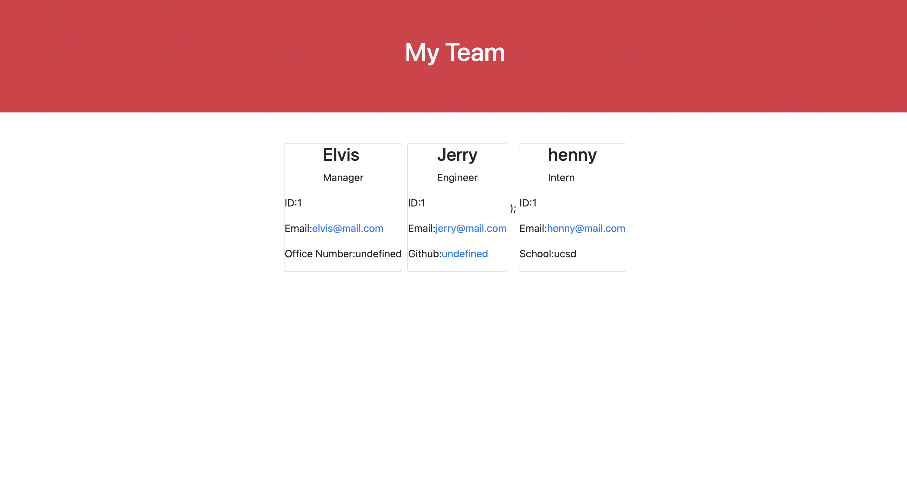

# Team Profile Generator

## 

## Description

A command-line application that displays inputted information generating a HTML page that displays the results in the given format. This application utilized Jest to run unit tests and inquirer to collect user input.

## Table of Contents

- [Installation](#installation)

- [Tests](#tests)

- [Usage](#usage)

- [Screenshots](#screenshots)

- [Demo](#demo)

- [Acknowledgements](#acknowledgements)

## Installation

Run dependencies:

```bash
npm i
```

## Tests

```bash
npm test
```

## Usage

to start the command line app:

```bash
node index.js
```

## Screenshots

- A sample for the command-line application.  
  
- This is the sample HTML file.  
  

## Demo

// add video

## Acknowledgements

- Oliver Shi
- Arvin John Bautista
